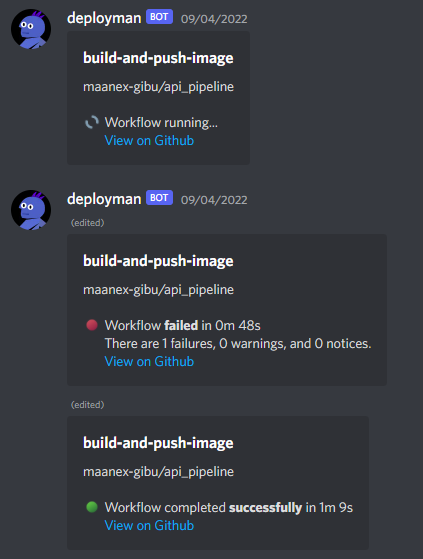

# deployman

A little utility that receives github webhooks, formats them and forwards them to discord.

It also allows to configure docker deployments so new images in the ghcr can be deployed with a click of a button.

This is still wip and I would not recommend using this yourself at this point in time.

## Screenshot because

